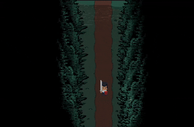

# Demon Back

**Demon Back** is the first original game project I created using Pygame. It follows a short story-driven adventure where you are tasked with helping a frog retrieve his stolen cookies from goblins.



---

## Overview

The player is recruited by a mysterious figure to assist a frog whose cookies have been taken by goblins. The game features a compact storyline, simple pixel art, and basic combat mechanics. It is built entirely in Python using the Pygame library.

## Features

* Pixel art animations
* Simple story progression
* Basic combat system
* Two enemy types: goons and a boss
* Sound effects
* Credits screen listing all art contributors

## Controls

* **Move**: WASD or arrow keys
* **Attack**: Space bar
* **Dodge**: Shift key

## Known Limitations

* Performance optimization is limited due to an unoptimized game loop
* No visual effect for dodging
* Enemies can overlap due to lack of collision handling between them
* Attacks require the player to be very close to enemies to register

## Future Improvements

* Improve loop efficiency for better performance
* Add a visual dodge animation or effect
* Implement collision avoidance between enemies
* Refine hit detection in the combat system

## Running the Game

### Requirements

* Python 3.8 or higher
* Pygame

### How to Run

1. Install dependencies:

   ```bash
   pip install pygame
   ```
2. Run the game:

   ```bash
   python main.py
   ```

## License

This project is provided for educational and non-commercial use. Feel free to use the code with attribution.