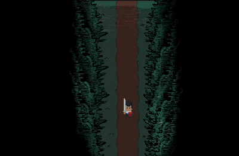

# Demon Back

Demon Back is my first game, made in Pygame. It is a short top down adventure where a stranger sends you to help a frog get his cookies back from goblins, across seven levels up to the goblin king.

Move with wasd or the arrows, attack with space, dodge with shift. Run it with python demonBack.py from the repo root, you need pygame. It is old and rough, the enemies do not collide with each other and hits only land when you are right on top of something.
